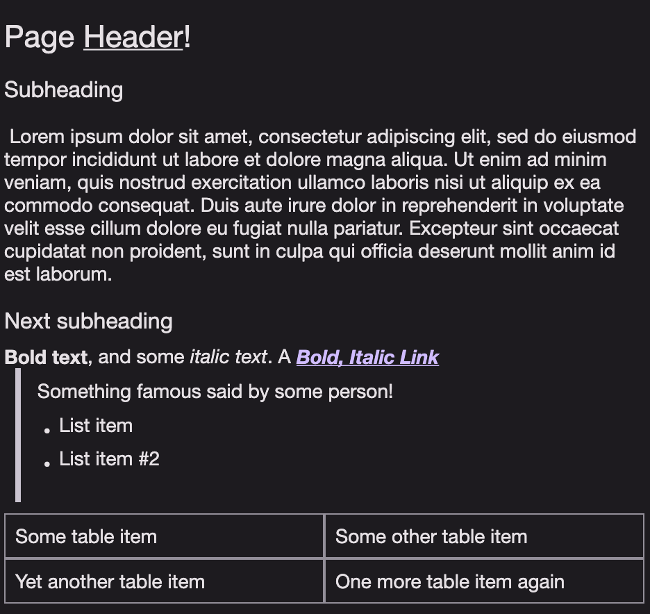
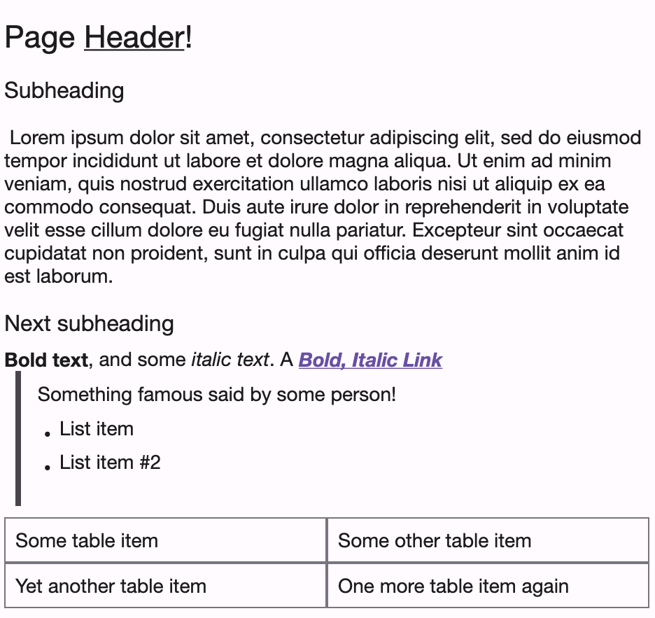

# HtmlText

A simple HTML renderer for Compose Multiplatform.




### Usage

```kotlin
HtmlText("<b>Your <u>HTML</u> here!</b>")
```

Optionally, specify a `baseUri` including http(s) prefix so URLs pointing to `/<dir>` are picked up.

### Supported Tags

 * Headings:
   * # `<h1>`
   * ## `<h2>`
   * ### `<h3>`
 * **Bold**: `<b>`
 * *Italic*: `<i>` or `<em>`
 * <u>Underline</u>: `<u>`
 * ~~Strikethrough~~: `<strike>`
 * [Links](): `<a href="">`
 * 1. Ordered Lists: `<ol>`
   1. UnorderedLists: `<ul>`
 * > Blockquotes: `<blockquote>`
 * | Tables | Implementation                   |
   | ------ | -------------------------------- |
   | (WIP)  | `<table><tbody></tbody></table>` |
 * : \

#### Extending with your own tags!

HtmlText additionally supports implementing your own tags, or overriding the existing
implementations:

```kt
private enum class NamedColor(val color: Color) {
    Red(Color.Red),
    Green(Color.Green),
    Blue(Color.Blue)
    // ...
}

/**
 * A colourable HTML element, using an attribute `color` to set its content's colour.
 */
val HtmlColorable = HtmlElementRenderer { element, modifier ->

    val color = element.attr("color")
        .takeIf { it.isNotBlank() }
        ?.lowercase()
        ?.let { NamedColor.entries.find { entry -> entry.name.lowercase() == it } }
        ?.color
        ?: LocalContentColor.current

    ProvideTextStyle(TextStyle(color = color)) {
        HtmlChildRenderer(element, modifier)
    }

}

@Composable
fun App() {

    val originalTagMap = LocalHtmlTextTagMap.current
    val extendedTagMap = remember {
        originalTagMap.extend(
            "colorable" to HtmlColorable
        )
    }

    CompositionLocalProvider(LocalHtmlTextTagMap provides extendedTagMap) {
        HtmlText(document)
    }
    
}
```
